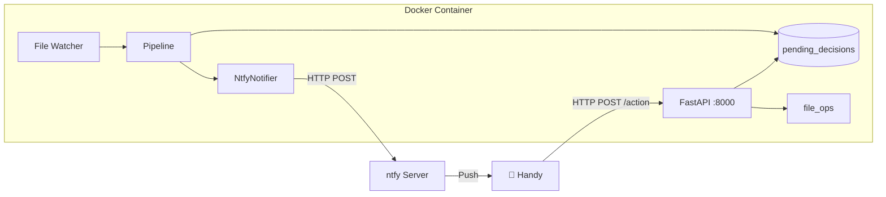

# Architecture

## Stack
- **Python 3.12+**, managed by **uv**
- Fully asynchronous (`asyncio`) – no blocking calls
- **FastAPI** + **uvicorn** for the webhook server
- **httpx** for outgoing ntfy notifications
- Deployed as a single Docker container

## Project Layout
```
src/
├── main.py          # Entry point – wires uvicorn + file watcher
├── config.py        # Settings dataclass, loaded from .env
├── watcher.py       # watchfiles-based inbox monitor
├── pipeline.py      # Full document processing pipeline
├── ocr.py           # OCR + preview generation
├── llm.py           # LLM analysis via litellm
├── models.py        # Pydantic data models
├── file_ops.py      # File move / rename / cleanup helpers
├── notifier.py      # NtfyNotifier – push notifications via ntfy
└── webhook.py       # FastAPI app – receives ntfy action callbacks

pyproject.toml       # uv project + dependencies
Dockerfile           # python:3.12-slim + system deps + uv
docker-compose.yml   # Container definition with volume mounts + port
.env                 # Runtime secrets (not committed)
```

## Volume Mounts
| Mount | Purpose |
|---|---|
| `/app/inbox` | Watched directory – new scans land here |
| `/app/archive` | Target archive with category subfolders |
| `/app/pending` | Temp storage while awaiting user decision via ntfy |
| `/app/error` | Failed or rejected documents |

## Exposed Ports
| Port | Purpose |
|---|---|
| `8000` | FastAPI webhook server (receives ntfy action-button callbacks) |

## Runtime Flow
```
asyncio.run(main)
  ├── uvicorn.Server (FastAPI on :8000)
  └── watchfiles.awatch(/app/inbox)
        └── per PDF → asyncio.create_task(process_file)
```

The uvicorn server and file watcher run concurrently via `asyncio.gather()`. Each incoming PDF spawns an independent task so multiple files can be processed in parallel. The FastAPI server handles incoming action callbacks from ntfy push notifications.



## Environment Variables
| Variable | Required | Description |
|---|---|---|
| `OPENAI_API_KEY` | Yes | API key for litellm → gpt-4o-mini |
| `NTFY_URL` | Yes | Full URL to the ntfy topic (e.g. `http://ntfy.local/my_topic`) |
| `NTFY_TOKEN` | No | Bearer token for authenticated ntfy topics |
| `SECRET_TOKEN` | Yes | Shared secret embedded in callback URLs for authorisation |
| `CALLBACK_BASE_URL` | Yes | Base URL the phone uses to reach FastAPI (e.g. `http://192.168.1.100:8000`) |
| `WEBHOOK_PORT` | No | FastAPI server port (default: `8000`) |
| `IGNORE_FOLDERS` | No | Comma-separated folder names to skip during category scan |

## Blacklist
Folders matching any of these names are excluded from category scanning and never offered as targets:
- **System**: `@eaDir`, `.snapshot`, `#recycle`, `.DS_Store`, `@tmp`
- **User-defined**: values from `IGNORE_FOLDERS`

Filtering happens in-place during `os.walk()`, so blacklisted subtrees are never traversed.
