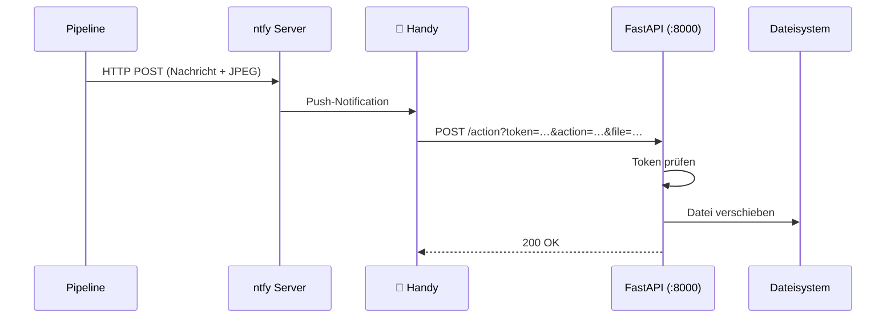

# Notifications & Webhook

Push-Benachrichtigungen laufen über einen lokalen **ntfy**-Server. Benutzer-Entscheidungen werden über **Action Buttons** in der ntfy-App getriggert, die HTTP-Requests an den eingebetteten **FastAPI**-Server senden.

## Ablauf



## Sicherheit

- Ein `SECRET_TOKEN` (aus `.env`) wird in die Callback-URLs der Action Buttons eingebettet.
- Jeder Request an `POST /action` wird gegen diesen Token geprüft. Bei Mismatch → `403 Forbidden`.
- Optional: ntfy Access-Token (`NTFY_TOKEN`) als `Authorization: Bearer`-Header für geschützte Topics.
- Kein HTTPS nötig – alles läuft im lokalen Netzwerk.

## Benachrichtigungen (ntfy)

Alle Benachrichtigungen werden als HTTP POST an die konfigurierte `NTFY_URL` gesendet. Implementiert in `src/notifier.py` (`NtfyNotifier`-Klasse).

### Auto-filed (bestehende Kategorie)
Text-only Push:
```
Titel: ✅ Automatisch abgelegt
Tags:  ✅📂

Datei 2025-03-15_Steuerbescheid.pdf erfolgreich nach Finanzen/Steuern verschoben.
```

### Neue Kategorie vorgeschlagen
Push mit JPEG-Preview (Seite 1) als Attachment + 4 Action Buttons:
```
Titel: Neues Dokument einordnen
Tags:  📄
Bild:  [Seite 1 als JPEG-Attachment]

📄 Neuer Ordner vorgeschlagen

Datei: 2025-03-15_Mietvertrag.pdf
Vorgeschlagener Ordner: Wohnung/Mietverträge

Buttons:
  [ 📂 Erstellen → Wohnung/Mietverträge ]
  [ ➡️ Finanzen/Verträge ]
  [ ➡️ Versicherungen ]
  [ ❌ Ablehnen ]
```

Jeder Button sendet per `method=POST` einen Request an die Callback-URL. `clear=true` dismissed die Notification nach dem Tap.

### Fehler
Text-only Push mit hoher Priorität:
```
Titel:    ❌ Fehler bei Verarbeitung
Priorität: high
Tags:      🚨

Datei: scan.pdf
Fehler: No text extractable (even after OCR).

Die Datei wurde nach /app/error verschoben.
```

## ntfy HTTP Headers

| Header | Verwendung |
|---|---|
| `X-Title` | Titel der Notification |
| `X-Message` | Nachrichtentext (bei Attachment-Upload) |
| `X-Filename` | Dateiname des JPEG-Attachments |
| `X-Priority` | Priorität (`high` bei Fehlern) |
| `X-Tags` | Emoji-Tags für visuelle Kennzeichnung |
| `X-Actions` | Action Buttons (Typ `http`, mit Callback-URL) |
| `Authorization` | Optional: `Bearer {NTFY_TOKEN}` |

## Webhook-Endpunkte (FastAPI)

Implementiert in `src/webhook.py`.

### `POST /action`

Empfängt ntfy Action-Button Callbacks.

**Query-Parameter:**
| Parameter | Typ | Beschreibung |
|---|---|---|
| `token` | string | Secret Token (muss `SECRET_TOKEN` aus `.env` entsprechen) |
| `action` | string | `create`, `alt1`, `alt2` oder `reject` |
| `file` | string | Dateiname in `/app/pending` |

**Aktionen:**
| Action | Verhalten |
|---|---|
| `create` | Erstellt `suggested_category` in `/app/archive/`, verschiebt Datei dorthin |
| `alt1` | Verschiebt Datei nach `/app/archive/{alternative_1}/` |
| `alt2` | Verschiebt Datei nach `/app/archive/{alternative_2}/` |
| `reject` | Verschiebt Datei nach `/app/error/` |

**Responses:**
| Status | Bedeutung |
|---|---|
| `200` | Aktion erfolgreich, JSON mit Ergebnis-Meldung |
| `400` | Unbekannte Aktion |
| `403` | Ungültiger Token |
| `404` | Datei nicht in `pending_decisions` oder nicht auf Disk |
| `500` | Fehler bei Dateioperation |

Nach jeder Aktion wird die Datei aus dem `pending_decisions`-Dict entfernt (im `finally`-Block).

### `GET /health`

Health-Check für Monitoring / Docker.

```json
{"status": "ok", "pending": 3}
```

## State

Pending Decisions werden in einem `dict[str, DocumentMetadata]` gespeichert (Dateiname → LLM-Metadaten). Dieser State ist in-memory only – ein Container-Neustart verliert offene Entscheidungen (Dateien bleiben in `/app/pending`).
